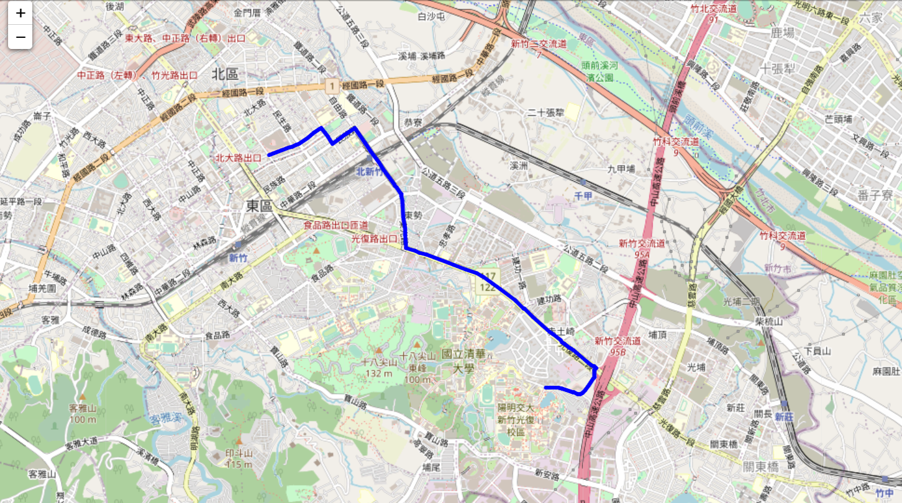
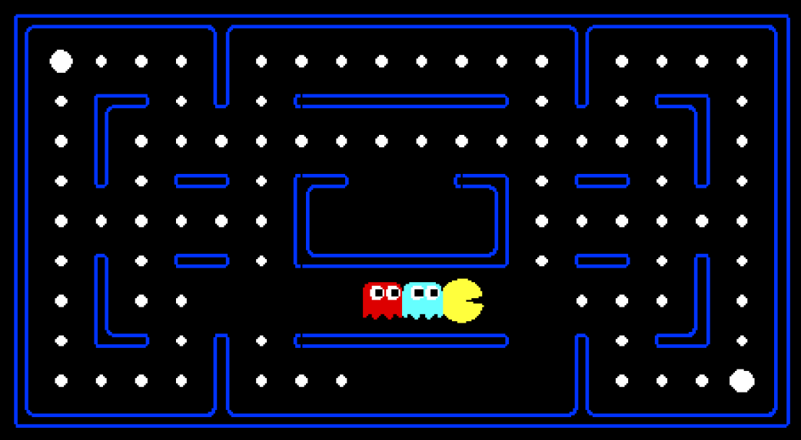
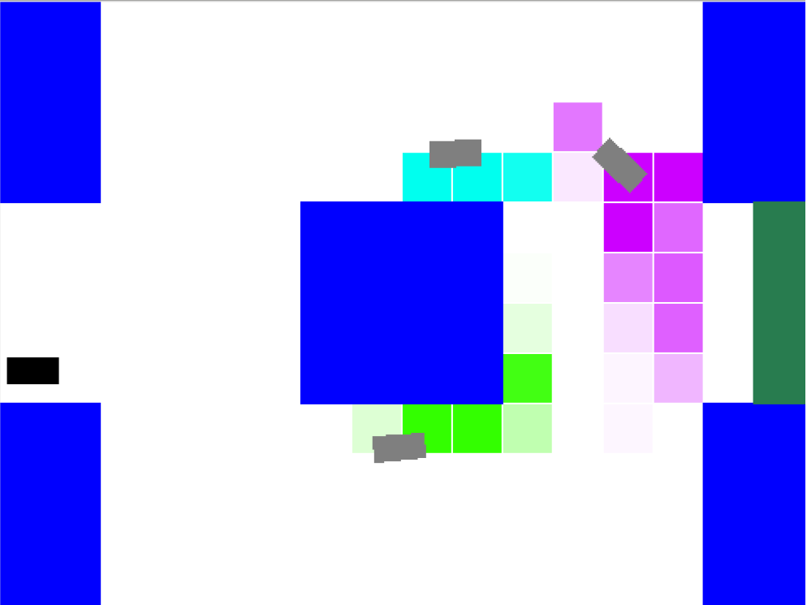

# NYCU_2022_AI_intro
## Introduction of artificial intelligence
### HW1 : Face Detection
Implement Viola-Jones face detection with Adaboost algorithm to detect human face
### HW2 : Route Search in Navigation system
Implement different search algorithms like BFS/DFS/A*/uniform cost to find the route to destination

### HW3 : Adversarial Search in Pacman Game
Implement different adversarial search algorithms like Minimax Search, Alpha-Beta Pruning, Expectimax Search to control the multi-agent for pacman game

### HW4 :
Implement reinforcement learning like Q-Learning, DQN on cartpole game in gym enviornment

### Hw5 :
Implement Bayesian-based algorithm to track the car in the structural environment

